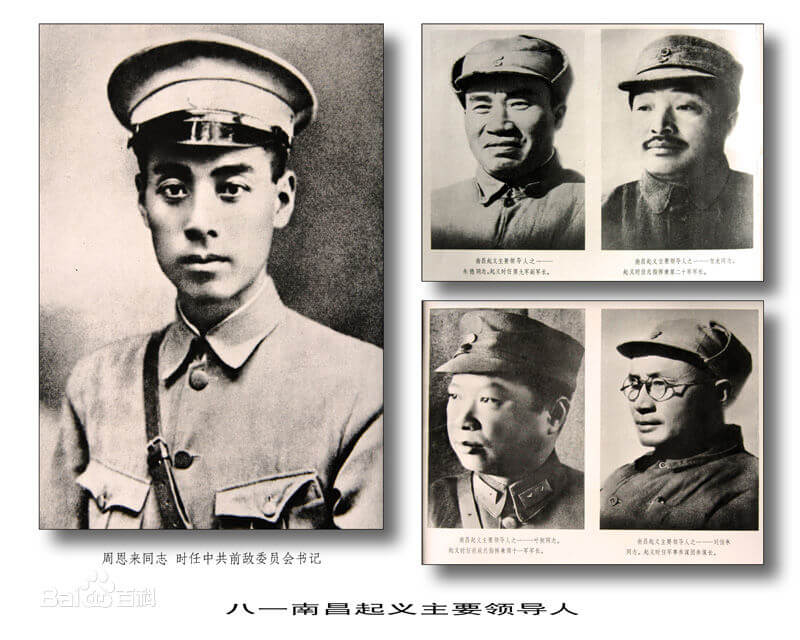

# 背景介绍
&emsp;&emsp;八一南昌起义，又称南昌起义或者八一起义，指在**1927年8月1日**中共联合国民党左派，打响了武装反抗国民党反动派的第一枪，**揭开了中国共产党独立领导武装斗争和创建革命军队的序幕**。

&emsp;&emsp;1927年8月1日2时，在**周恩来、贺龙、叶挺、朱德、刘伯承**的领导下，南昌起义开始。按照中共前委的作战计划，第20军第1、第2师向旧藩台衙门、大士院街、牛行车站等处守军发起进攻；第11军、第24师向松柏巷天主教堂、新营房、百花洲等处守军发起进攻。

&emsp;&emsp;激战至拂晓，全歼守军3000余人，缴获各种枪5000余支（挺），子弹70余万发，大炮数门。当日下午，驻马回岭的第25师第73团全部、第75团3个营和第74团机枪连，在**聂荣臻、周士第**率领下起义，1927年8月2日到达南昌集中。1927年8月2日，南昌市各界群众数万人集会，庆祝南昌起义的伟大胜利和革命委员会的成立。

&emsp;&emsp;至此，南昌起义宣告成功。虽然最终起义部队23000多人在敌人的围追堵截下只剩下800多人，但作为革命军队的火种，他们在**朱德**的带领下上井冈山与**毛泽东**的秋收起义部队会合，从此开始了“**星星之火，可以燎原**”之势，奠定了一步步走向革命胜利的基础。

&emsp;&emsp;1928年4月，**朱、陈**率部到达井冈山，与毛泽东领导的秋收起义部队会师。南昌起义打响了武装反抗国民党反动派的第一枪，是中国共产党独立地领导武装斗争和创建人民军队的开始。1933年7月1日，中华苏维埃共和国临时中央政府作出决议，规定8月1日为人民军队的建军节。

