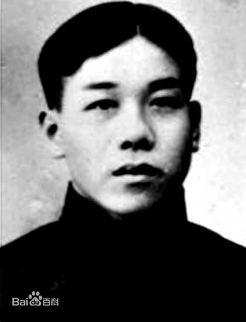
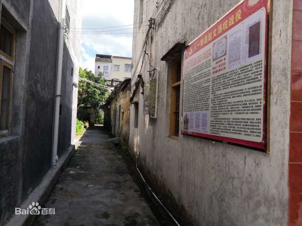

# 陈恭谈南昌起义
## 报告人介绍
&emsp;&emsp;陈恭（1905-1928），**革命烈士**，广州起义总指挥部副长官，湘东游击队司令员。1905年9月出生于湖南省醴陵县（今醴陵市）泗汾镇。1923年加入**共产主义青年团**。1924年10月入**黄埔军校第二期步兵科**。同年底加入**中国共产党**。1926年7月参加**北伐**，任左翼军宣传队副队长。1928年4月12日在醴陵县城遇害。

## 汤坑之役作战经过
> 九月二十七日，总指挥部在揭阳接到汤坑谍报，当晚发现敌方大概有千余人在汤坑准备集中攻击军队。当晚我军即下令迅速解决战斗，于是次日早晨出发，最开始很顺利的节节击退敌军，并俘获了少量俘虏和枪械，当晚发现敌军在距汤坑之地约20里地戒备森严，于是在次晨拂晓又开展战斗，敌军仍占据着高地，依仗凶猛的火力跟我军战斗，虽然我军浴血奋战拼下高山，但敌军的增援不断，很快占据另一高山与之抗衡，兵力增多的同时，兵器也极其精锐不易击溃，我军在白天以极其猛烈之火扫射但仍处于下风，在尝试夜袭不成时，因损失超过原人数一半所以下令撤退。

## 失败原因分析
1. 远因：
	- “八一”革命后本党**政策**的错误：在“八一”革命后我们的军事和政治都陷入孤立，没有外人与自己合作，在**军事计划**方面，不应在敌军主力未被击破以前而让我方部队在潮汕，揭阳等处停顿，这给足了敌人调遣集中的时机。
2. 近因：
	- **战术方面**：
		- 一是侦查不确实，在汤坑之役之前，我方侦查敌人不过千数百人，而实际数量远不于此，对敌军的不了解和轻敌也是失败的很重要的原因。
		- 二是战斗的持续性不够，在汤坑退却之前，我方与敌军已经抗拒相持两昼夜，且曾经夺取过对方阵地，但之后彼此相持二十小时左右，我方率先败退，有兵力不足的原因，也有恒心不够的缘故。
	- **战斗方面**：
		- 一是我方的器械连日使用，未能妥善保管，导致有些枪支虽有却不能用，比如很多机关枪，再者就是弹药短少，无法补充。
3. 总结：
	- 此次汤坑之役伤亡惨重，死伤过千人，且由于**救护条件**较差，我军重伤官兵很多都被遗弃到道路无法搬运。
