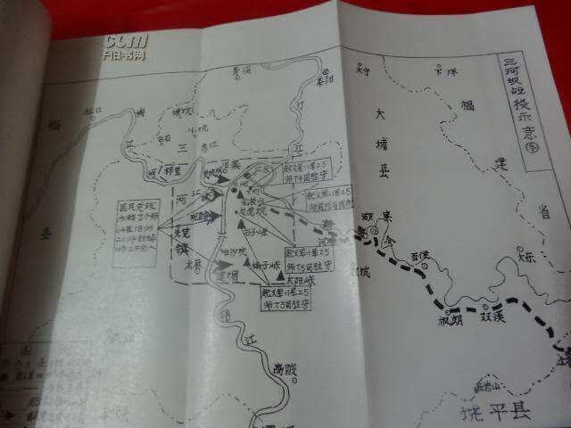
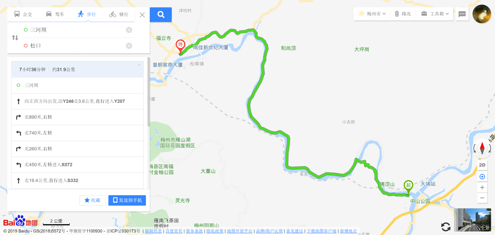

# 从焦其恺看三河坝战役
## 三河坝战役
&emsp;&emsp;1927年八一南昌起义后，国民党反动派调兵遣将，“讨伐”起义军。八一南昌起义部队主动撤离南昌，南下广东，目标是“**先得潮、汕、海陆丰，建立工农政权，后取广州，再举北伐**”。

- 9月18日，部队进抵广东大埔县城。
- 9月20日，前委根据形势发展做出了分兵部署：
	- 周恩来、贺龙等率领主力向潮州、汕头进发；
	- 第9军副军长朱德率领第11军25师和第9军教导团共约3000多人，据守三河坝，掩护主力南下。

&emsp;&emsp;焦其恺在所写《从广东回来的报告》中，专题讲述了“三河坝之役”。他叙述道：“因我军由闽到三河时，已知敌中央军赶到梅县，右翼军集中松口，我军随以二十五师及第九军（约一营）向该敌警戒，至我军大部开去潮汕，并与汤坑之敌正式接触，敌以大部分中央军进袭潮汕，我军因**众寡不敌**（守潮者为教团，守汕者为六团防备海军）自然失败，损失大甚，**所有空枪约五千枝全被敌人夺去**。一面影响汤坑作战军队，一面更影响了三河坝二十五师，及至二十五与敌接触，已成孤军奋斗。与敌战约二昼夜，战事尚堪支持，后敌以一师部队占据对河之东文部夹击，其正面之二师人自然得手，然我军犹能渡河冲出一团余众，终以众寡太相悬殊，结果失败。”

## 总结
&emsp;&emsp;从他的报告中我们可以总结出：

- **原本目的**：守住三河坝掩护大军主力南下。
- **不利因素**：敌众我寡（国军20000余人，起义军3000余人），装备被夺。

&emsp;&emsp;最终激战3昼夜，予敌重创。因敌军数量过大，起义军苦战中寡不敌众，终归失败。是役，敌我双方伤亡惨重，消灭敌军1000多人，起义军伤亡俘散损失约1800多人。尽管这一战伤亡惨烈但是意义重大，三河坝战役更被视为探索中国革命的中心从城市到农村，军事上从正规战到游击战转变的重要转折点，流传开了“**没有三河坝战役，就没有井冈山会师**”的历史评价。

## 《建军大业》
<video width="100%" controls>
	<source src="../../static/jiao-qi-kai-1.mp4" type="video/mp4" />
	Your browser does not support the video tag.
</video>

## 参考
- [蔡晴川, 孙树成. 《坚守三河坝 激战三昼夜》, 法制晚报, 2017年8月1日.](http://news.hexun.com/2017-08-01/190273522.html)
