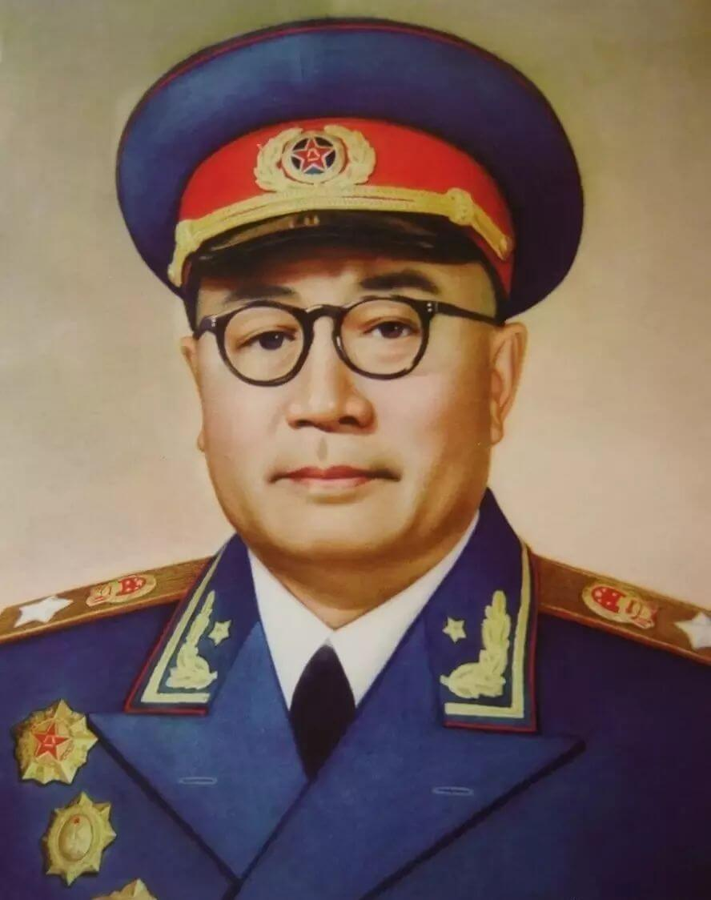

# 刘伯承对南昌暴动的个人总结
&emsp;&emsp;刘伯承（1892年12月4日-1986年10月7日），原名刘明昭，四川开县人（今重庆市开州区）。**中国共产党的优秀党员**，**中华人民共和国元帅**，**中国人民解放军缔造者之一**，**伟大的无产阶级革命家、军事家、马克思主义军事理论家**，**军事教育家**。刘伯承在南昌起义中任参谋团参谋长。

## 周恩来评价刘伯承
1. 当时没有人任主任，我就指定刘伯承同志做参谋长。他起初谦虚不肯答应，后来我说一定要你来做，他才担任参谋长职务。
2. 起义时，刘伯承同志所起的作用是很大的。

## 南昌暴动的总结
1. 共产党方面存在的**根本上**的弱点：
	1. **部队规模不足且军事人才缺乏**。参与起义的军队兵力仅二万出头，而敌方却有十万之众。虽然通常革命军队兵力较政府军小，但是基本都拥有大量群众基础，而南昌暴动却是在**工农觉悟不高且无有力军事要点**的江西，此时又是**国民党第三派联合成熟且工农及军事力量消减**之时，形势不利于共产党一方。
	2. **我军内部有大部分非党内同志领导的部队，导致作战无法如臂指使**。当时参加起义的部队除叶挺部和第二十五师中的一些部队党的基础较好外，其他部队党的力量均较薄弱。多数起义部队对起义的目的并不明确，甚至一些部队完全是形势所迫不得不参加起义。（最明显的就是蔡廷锴的第十师。）因此在行军过程中**反动派**（蔡廷锴、陈裕新之流）与**无政治认识之混子**的叛逃导致我方力量大为减弱。虽说敌我存在差距，但如善用反革命阵营中的利害冲突，仍有相当胜算。
2. **行动上**所犯的错误：
	1. 在暴动中我们的党应无论何时都要以精密的组织领导一切行动。南昌起义的总领导者是前敌委员会，然而各同志处理紧要事件不完全由前委开会决定，造成**党的纪律松懈权力不聚，失掉领导暴动的重心**。作战时谁也不能指挥谁，完全是以友谊协商的形式进行，这样如何能说是作战。
	2. 暴动时**没有把革命的决心彻底拿出来**。军队所到之处没有立即对地主豪绅资产阶级采取猛力摧毁其组织政权的方式，而是偏向于犹豫妥协，与他们和平磋商，因此**未能获得当地工农的支持**。（广东一工人说“这是蒋介石第三的军队”）我军财政应当从剥削地主而来，由于在这方面举棋不定使得款项支出最后影响了军事。
	3. **对农民的宣传力度不足**，对所过之地的政治宣传多采取**敷衍**的态度，写一些解放农民条例全文、没收两百亩以上土地、打到广东去之类的标语贴在路边；各地政府随经改组但看得出我军不会长留，也是以敷衍的态度。在最短时间内觉悟农民组织农民自然不可能，但到一地宣传也应努力为止，才能为共产党争取更多群众力量。
