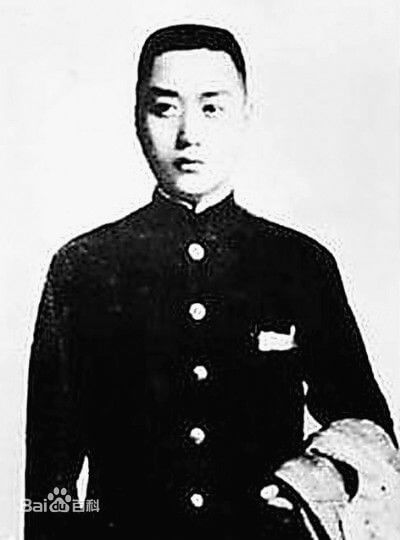

# 周逸群
&emsp;&emsp;周逸群是**中国共产党的优秀党员**，杰出的**无产阶级革命家、军事家、宣传家、活动家**，**早期中国共产党军队的缔造者之一**，**中国共产党三大革命根据地之湘鄂西革命根据地和湘鄂西红军的创建者之一**。1927年8月参加南昌起义，起义军南下后任第20军第3师师长，率部参加瑞金、会昌等战斗。曾介绍**贺龙**加入中国共产党。起义军在广州潮汕地区失利后辗转到上海。

## 总结
&emsp;&emsp;首先周逸群代表贺龙和20军的全体官兵**表明了起义的决心**，他亲临火线指导，并在初步胜利后又及时安排人员，接应未及时赶到的部队，接待和安置零散赶到的工农兵，**大体上保持了起义后的各项工作的稳定进行**。

&emsp;&emsp;**南征路线**，关系到起义军的成败，因此在选择决定时必须慎之又慎。然而军事参谋团决定选择小路——这条已经被实践证明了的失败的行军路线。周逸群则在报告扼要地说明主张吉安大道的理由：“**首先解决朱培德，以壮声威。**”这是鼓舞士气的最佳决策。一味避敌攻击的策略不可取。（这也在他总结失败的经验中提到了）他敢于冒着“动摇军心”的风险，提出重新考虑南征路线问题，足以反映出他对于革命事业的**极端负责**的精神。但是这个建议最终没有被采纳，从而在战略上出现了失误。

&emsp;&emsp;除了战略上的失误，几场战役的相继失败也反应出了一些问题。**士兵战斗力差**，**人心涣散**，**医疗条件和后勤质量得不到保障**等客观因素尚可以理解，但更致命的在于**“党”与“军”**所构成的暴动组合关系，对中共和暴动所产生的更为明显的影响是，由于中共对军系力量依赖很大，迁就很多，因此暴动军队的松散性是显而易见的，在很大程度上反映着**军系内部的结构缺陷或组织特征**。此前中共通过周逸群的关系对贺龙部队已有所渗透，还曾将鄂城、大治等地的工人纠察队编入其教导团，然而即便如此，仍无把握掌控这支部队，更多时候仍需依靠贺龙的个人权威开展工作。

&emsp;&emsp;但是无论如何，通过阅读周逸群的报告，我们可以看出：起义失败后，周逸群客观公正地向中央报告了南昌起义的情况，并对失败的原因陈述了自己的观点，也对今后加强党建与实行土地革命也提出了独到的见解。这反映出了他对于革命做出的巨大贡献。
